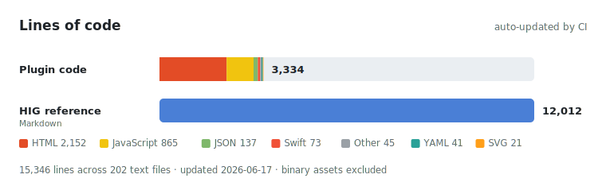

# apple-hig

A Claude Code plugin that makes Claude design and review user interfaces according to Apple's Human
Interface Guidelines (HIG), automatically choosing the correct platform scope — iOS, iPadOS, macOS,
watchOS, tvOS, or visionOS — for whatever is being built.

![One flight tracker, three ways. Top left, vanilla Claude Code: a plain flat US map, two identical outline buttons with no clear primary action, and flat gray status pills. Top right, the same app after the apple-hig plugin reviews it: the same real US map with one prominent capsule action, semantic color-coded status pills, and a clearer title and hierarchy. Bottom, Skytrace, a tracker designed to Apple's HIG from scratch with the plugin: Liquid Glass chrome floating over a real North-Pacific map showing the San Francisco to Tokyo great-circle route, with labeled live metrics.](docs/flight-compare.png)

**Website:** <https://elevatormusic.github.io/apple-hig/>  ·  **Try the build live:** [Skytrace](https://elevatormusic.github.io/apple-hig/mockups/ft-scratch.html)  ·  *(all three above were made with Claude Code — only the right/bottom used the plugin)*

## About

`apple-hig` gives Claude a complete, on-disk copy of Apple's design guidance, organized the way Apple
organizes the HIG (Foundations, Patterns, Components, Inputs, Technologies), plus per-platform device
specs and a consolidated design-token file. Because the reference ships with the plugin, Claude never
has to fetch Apple at runtime; a router skill loads only the few files relevant to the current task.

It is meant for anyone building Apple-platform UI — in SwiftUI, UIKit, AppKit, or a cross-platform
stack — who wants the output to follow the HIG by default instead of as an afterthought. When you ask
for a screen, a component, or a review, the skill activates on its own, pulls the right rules and exact
values, and applies them. For non-Apple targets (web, Android) it keeps Apple's principles and tokens
but defers to the host platform's conventions rather than imposing iOS chrome.

The reference reflects the current design language, **Liquid Glass** (the "26" generation), refined at
WWDC 2026 into the **iOS/iPadOS/macOS 27 ("Golden Gate")** generation. Its exact values — the type
ramp, the system color palette and its dark-mode variants, device sizes, hit-target and contrast
minimums — were verified against Apple's live HIG. Every file stores a canonical `source_url` and a
"verify on Apple" note, because these specs move with each release.

## Licensing and assets (read this first)

This plugin contains **no Apple binary assets**. It references Apple's fonts, SF Symbols, and design
templates by name and links to Apple's official downloads — it never bundles or redistributes them.

- **SF fonts** (SF Pro, SF Compact, SF Mono, New York, and the non-Latin SF families) are licensed
  *solely* for creating mock-ups of UI for software running on Apple's iOS, iPadOS, macOS, or tvOS.
  They may not be redistributed, embedded, or used to mock up non-Apple-OS interfaces. SF Compact is
  watchOS-only.
- **SF Symbols** are system-provided images. They may **not** be used in app icons, logos, or any other
  trademarked use — and may not be redistributed.
- **Apple Design Resources / templates** are licensed for Apple-platform UI mock-ups only.

When building for **web or Android**, do not ship SF fonts; use the system font stack
(`-apple-system, BlinkMacSystemFont, "Segoe UI", Roboto, …`) or a freely licensed family such as Inter.

Full details and the official download URLs are in
[`skills/apple-hig/guidelines/licensing-and-assets.md`](skills/apple-hig/guidelines/licensing-and-assets.md).
The reference text (numbers, semantic names, links) is factual and freely usable; Apple's binary assets
remain Apple's property and are not included here.

## Design guidelines at a glance

The rules and values the plugin applies. The full, sourced detail is under
[`skills/apple-hig/guidelines/`](skills/apple-hig/guidelines/).

**Principles.** Establish a clear **Hierarchy** (controls elevate the content beneath them), **Harmony**
(match the concentric design of the hardware — nested corner radii share a center), and **Consistency**
(adopt platform conventions; adapt continuously across sizes). The classic Clarity, Deference, Depth
still underlie the system. Defer to content; prefer system components; design light and dark together.

**Liquid Glass.** The navigation layer (bars, sidebars, controls, sheets) floats above the content in a
dynamic glass material with two variants, *regular* and *clear*; the content layer stays opaque. Honor
Reduce Transparency and Increase Contrast. The "27"/Golden Gate refinement adds a user transparency
slider, stronger contrast, and standardized window borders.

**Color.** Use **semantic** colors (`label`, `systemBackground`, accent/tint), never hardcoded hex, so
they adapt to appearance, contrast, and wide gamut. The system palette has 12 tints including the added
**Mint** (`#00C7BE`/`#63E6E2`) and **Cyan** (`#32ADE6`/`#64D2FF`); systemTeal is `#30B0C7`/`#40CBE0`.
Every color has a light and a dark value.

**Typography.** System fonts are SF Pro / SF Compact (watchOS) / New York; support **Dynamic Type**
(use text styles, not fixed sizes). iOS "Large" ramp: Large Title 34/41, Title 1 28/34, Headline & Body
17/22, Subhead 15/20, Caption 2 11/13 (size/leading pt). macOS does not support Dynamic Type.

**Layout and targets.** Work in points; respect safe areas (notch/Dynamic Island, Home indicator,
overscan); use an 8 pt spacing rhythm and size classes. Minimum hit target **44×44 pt** (visionOS
**60×60**); Apple's control-size table lists 44 as the default with 28×28 as the floor (macOS 28/20,
tvOS 66/56).

**Accessibility.** Contrast **4.5:1** body, **3:1** large (≥18 pt / bold); never convey meaning by color
alone; VoiceOver labels on every control, including icon-only ones; provide a **Reduce Motion**
alternative for any animation; support the full Dynamic Type range.

**Per-platform navigation.** iOS — tab bar (2–5, a floating Liquid Glass capsule on 26) plus a
navigation stack. iPadOS / macOS — sidebar + split view + toolbar; macOS has the menu bar. watchOS —
Digital Crown and complications. tvOS — the focus engine and Top Shelf. visionOS — windows, volumes,
spaces, and ornaments, with eyes-and-hands input.

## What you get

- **Auto-activating skill** (`apple-hig`) — a router that triggers on any UI/design/review task for an
  Apple platform (or any product that should follow the HIG) and loads only the relevant guideline
  files. You do not need to name it.
- **`design-reviewer` subagent** — audits UI code (SwiftUI/UIKit/AppKit, React/React Native, Flutter,
  HTML/CSS) and reports violations with the rule, the Apple `source_url`, the location, and a concrete
  fix. Catches sub-44 pt targets, hardcoded/non-semantic colors, missing dark-mode variants, off-grid
  spacing, low contrast, non-standard radii, motion that ignores Reduce Motion, janky/always-on
  animations (looping a non-compositable property, or never pausing off-screen), and more.
- **Commands**
  - `/hig-review [path]` — run the design-reviewer on the current file/selection or a path.
  - `/hig-scaffold <platform> <component/screen> [stack]` — generate a HIG-compliant component or
    screen, including a real Apple Maps view (MapKit JS for web, SwiftUI `Map` for native).
  - `/hig-tokens <css|tailwind|json|swiftui|react-native>` — emit the design tokens (colors, type ramp,
    spacing, radii, control sizes) in the requested format.
  - `/hig-sync` — on macOS + Xcode, read live colors and the Dynamic Type ramp from your installed SDK
    (see [Live values from your SDK](#live-values-from-your-sdk-macos)).
- **Commit gate (hook)** — a PreToolUse hook blocks a Claude-run `git commit` that stages UI files
  until a HIG review passes; see [Mandatory review gate](#mandatory-review-gate). Turn it off with
  `HIG_GATE=off` or by deleting `hooks/hooks.json`.
- **Update notifier (hook)** — a SessionStart hook quietly checks GitHub at most once a day and, if a
  newer release exists, prints a one-line notice with the update command. It never blocks, never
  fetches more than the version string, and fails silently offline. Turn it off with
  `HIG_UPDATE_CHECK=off`; see [Update notifier](#update-notifier).

## Coverage

The reference mirrors Apple's HIG taxonomy: 20 foundations, 6 platforms, 63 components, 27 patterns, 13
inputs, and 29 technologies, plus a consolidated design-token file — every topic Apple documents.

That shape shows up in the line count too: a small engine wrapped around a large bundled reference. The
chart below is regenerated by CI ([`loc.yml`](.github/workflows/loc.yml) →
[`scripts/loc-graph.mjs`](scripts/loc-graph.mjs)) whenever the counts change, so it stays current.



## Install

`apple-hig@apple-hig` is `plugin-name@marketplace-name`. Install it either way:

**In a Claude Code session** (type these as slash commands):

```text
/plugin marketplace add elevatormusic/apple-hig
/plugin install apple-hig@apple-hig
```

**From a terminal** (the `claude` CLI — no interactive session needed):

```text
claude plugin marketplace add elevatormusic/apple-hig
claude plugin install apple-hig@apple-hig
```

The first command adds this repo as a marketplace; the second installs the plugin (user scope by
default; add `--scope project` to install it for a single repo). Restart or start a new Claude Code
session for the plugin to load.

Verify and manage it:

```text
claude plugin list                       # confirm apple-hig is installed and enabled
claude plugin details apple-hig          # show the skill, commands, agent, and token cost
claude plugin update apple-hig           # pull a newer version (the notifier tells you when one exists)
claude plugin uninstall apple-hig        # remove it
claude plugin marketplace remove apple-hig
```

## What gets installed

`claude plugin details apple-hig` reports the component inventory and its projected token cost:

```text
Apple HIG (apple-hig) 1.5.0
Component inventory
  Skills (5)  apple-hig, hig-review, hig-scaffold, hig-sync, hig-tokens
  Agents (1)  design-reviewer
  Hooks  (2)  SessionStart (ready + update check), PreToolUse (commit gate)  (harness-only — no model context cost)
  MCP servers (0) · LSP servers (0)

Projected token cost
  Always-on: ~480 tok added to every session
  component        always-on  on-invoke
  apple-hig             ~180      ~2.5k
  design-reviewer       ~120      ~1.6k
  hig-review             ~50       ~390
  hig-scaffold           ~50       ~540
  hig-sync               ~45       ~600
  hig-tokens             ~40      ~1.2k
```

Only the small always-on descriptions sit in every session; the full guideline files load on demand
when a skill or the reviewer actually fires, and the router pulls just the handful of files relevant
to the task. (Token counts are estimates.)

## Usage

Just work on an Apple-platform UI and the skill activates on its own — no need to name it. It also
works for any app or website you want to feel Apple-clean. Some prompts that trigger it:

**Build / scaffold**
- "Design an iPhone **settings screen** in SwiftUI, HIG-compliant."
- "Build a **visionOS** detail view with an ornament toolbar."
- "Lay out a **macOS** preferences window with a sidebar and proper control sizes."
- "Make this React form follow Apple's spacing, type ramp, and dark mode."

**Review / fix**
- "**Review** `SettingsView.swift` for HIG compliance."
- "Audit this component's **touch targets, contrast, and dark-mode** coverage."
- "Why does this screen feel off vs. a native iOS app? Fix it."

**Redesign / improve**
- "**Redesign** this screen to Apple's macOS HIG." (paste your UI — like the flight tracker above)
- "Tidy the hierarchy and error states on this window."

**Tokens**
- "Give me the HIG **color + type tokens** as Tailwind." / "…as a SwiftUI `Color` extension."

Or drive the commands directly:

```text
/hig-scaffold ios settings screen swiftui
/hig-review Sources/SettingsView.swift
/hig-tokens css
/hig-tokens swiftui
```

### See it, don't just read it (optional)

Install the **Playwright MCP** alongside apple-hig and the reviewer can *render* your UI and verify it
visually — real contrast, spacing, target sizes, and dark mode — not just read the code:

```text
/plugin install playwright@claude-plugins-official
```

Then a prompt like "review this screen and **render it to check** contrast and dark mode" will screenshot
the running UI and report what it sees. (This is exactly how the before/after above was produced.)

## Mandatory review gate

Installing apple-hig turns on a commit gate: when Claude Code runs a `git commit` that stages **UI
files** (`.tsx .jsx .ts .js .vue .svelte .html .css .swift .kt …`), the commit is **blocked** until a
HIG review passes. Run `/hig-review --staged`; if it finds no 🔴 high-severity issues it records
approval (a content-hash marker), and the retried commit goes through. Editing the staged files
invalidates the marker, so you can't review once and then change the code.

**Scope & limits**

- Only intercepts commits Claude runs in-session (not terminal/IDE commits).
- "Pass" is judged by the `design-reviewer` agent, not a formal proof.

**Switches**

- `HIG_GATE=off` — disable the gate entirely.
- `HIG_GATE_BYPASS=1` — allow a single blocked commit (appended to a bypass log).
- `HIG_GATE_EXT=".tsx,.css,…"` — override the UI file extensions that trigger the gate.

## Update notifier

A SessionStart hook (`hooks/version-check.mjs`) tells you when a newer apple-hig release is out, so the
plugin doesn't quietly fall behind. It compares the installed `plugin.json` version against the one on
`main`, and if you're behind it prints a single line:

```text
apple-hig 1.6.0 is available (installed 1.5.0). Update: claude plugin update apple-hig@apple-hig
```

It is deliberately unobtrusive:

- **Notify only** — it never updates anything for you; you run the update command when you choose.
- **Throttled** — it checks GitHub at most once every 24 h and caches the result in your temp dir, so
  it isn't a network call on every session.
- **Minimal & private** — it fetches only the version string from
  `raw.githubusercontent.com/Elevatormusic/apple-hig/main/.claude-plugin/plugin.json`, with a 2 s
  timeout, and **fails silently** when offline or rate-limited (no errors, no noise).
- **Versions compared numerically** — `1.10.0` is correctly newer than `1.9.0`.

**Switch**

- `HIG_UPDATE_CHECK=off` (also `0`/`false`/`no`) — disable the check entirely.

## Live values from your SDK (macOS)

The bundled token reference is portable but can drift between OS releases, and Apple ships no design
data API. On **macOS with Xcode**, run `/hig-sync` (or `npm run hig-sync`) to read authoritative
current **colors** and the **Dynamic Type ramp** from your own installed SDK via a small Mac Catalyst
probe. Values are cached at `~/.cache/apple-hig/live-tokens.json`, and `/hig-tokens` plus HIG reviews
then prefer the cache over the bundle. Everyone else keeps the bundled reference unchanged.

- `HIG_SDK_SYNC=ask` (default) — offer to sync when values are needed and the cache is missing/stale.
- `HIG_SDK_SYNC=always` — sync without asking. `HIG_SDK_SYNC=never` — never sync; always use the bundle.
- `…/scripts/hig-sync.mjs --check <symbol> …` validates SF Symbol names against the installed set.

Note: control-size minimums, spacing, and corner radii aren't exposed at runtime, so they stay
bundled; Catalyst-resolved iOS values are very close but not a pure on-device render.

## Use it in other AI coding tools

The full plugin experience — the auto-activating skill, the `design-reviewer` subagent, and the
`/hig-*` commands — is specific to Claude Code. Every other tool can still use the **guidelines as
project rules**, generated from a single canonical ruleset.

### One command

Run this in your project. It writes the correct rules file for your tool (right path, right
frontmatter), derived from [`integrations/apple-hig.md`](integrations/apple-hig.md):

```text
npx github:elevatormusic/apple-hig --tool cursor
npx github:elevatormusic/apple-hig --tool agents,copilot,windsurf   # several at once
npx github:elevatormusic/apple-hig --tool all --vendor             # all tools + copy the guideline files into ./apple-hig/
```

No Node? Clone the repo and run `node scripts/install-rules.mjs --tool <slug>` (`--list` shows every
tool). `--vendor` copies the full 161-file guideline set into your project so the assistant can read
exact, sourced specs; otherwise the rules file carries the core rules and key tokens inline.

Tool slugs: `agents` · `cursor` · `windsurf` · `copilot` · `cline` · `roo` · `aider` · `gemini` ·
`amazonq` · `continue` · `junie` · `claude`.

### Or add the rules file by hand

Copy `integrations/apple-hig.md` to the path your tool reads (prepend the frontmatter where noted):

| Tool | File | Notes |
|---|---|---|
| **AGENTS.md standard** — OpenAI Codex, Zed, Gemini CLI, Aider*, Amp, goose, opencode, Jules, Factory, Warp, Kilo Code, RooCode, JetBrains Junie, GitHub Copilot coding agent, … | `AGENTS.md` (repo root) | Plain markdown, auto-discovered. One file covers many tools. |
| **Cursor** | `.cursor/rules/apple-hig.mdc` | Frontmatter: `description`, `globs:`, `alwaysApply: true` |
| **Windsurf** | `.windsurf/rules/apple-hig.md` | Frontmatter: `trigger: always_on` |
| **GitHub Copilot** | `.github/copilot-instructions.md` | Repo-wide. Or path-scope via `.github/instructions/*.instructions.md` (`applyTo`) |
| **Cline** | `.clinerules/apple-hig.md` | Plain markdown |
| **Roo Code** | `.roo/rules/apple-hig.md` | Plain markdown |
| **Aider** | `CONVENTIONS.md` | Not auto-loaded: add `read: CONVENTIONS.md` to `.aider.conf.yml` (or `aider --read CONVENTIONS.md`) |
| **Gemini CLI** | `GEMINI.md` | Or point `contextFileName` at `AGENTS.md` in `.gemini/settings.json` |
| **Amazon Q Developer** | `.amazonq/rules/apple-hig.md` | Plain markdown |
| **Continue** | `.continue/rules/apple-hig.md` | Frontmatter: `name`, `description`, `alwaysApply: true` |
| **JetBrains Junie / AI Assistant** | `.junie/guidelines.md` / `.aiassistant/rules/apple-hig.md` | Plain markdown |
| **Claude Code** | `CLAUDE.md` | Fallback only — prefer the native plugin above |

`* Aider` reads `AGENTS.md` only with the same `read:` opt-in. **AGENTS.md** is the closest cross-tool
standard — one file covers most of the list. These conventions move fast; check your tool's docs and
<https://agents.md> if a path has changed.

## How it works

`skills/apple-hig/SKILL.md` is a router, not the content. On each task it loads
`guidelines/universal.md`, detects the platform, then loads only the specific component/foundation/
pattern files needed (there is a keyword-to-file routing table in the skill). Exact numbers come from
`references/design-tokens.md`. Nothing is fetched from Apple at runtime.

## Repository layout

```text
apple-hig/
├── .claude-plugin/
│   ├── plugin.json            # plugin manifest
│   └── marketplace.json       # single-plugin marketplace (source: "./")
├── skills/apple-hig/
│   ├── SKILL.md               # auto-activating router
│   ├── guidelines/            # foundations, platforms, components, patterns, inputs, technologies
│   └── references/design-tokens.md
├── agents/design-reviewer.md
├── commands/                  # hig-review, hig-scaffold, hig-sync, hig-tokens
├── hooks/                     # hooks.json + hig-gate.mjs (commit gate) + version-check.mjs (update notifier)
├── scripts/                   # install-rules.mjs, hig-sync.mjs, sdk-probe/ (Mac Catalyst)
├── integrations/apple-hig.md  # canonical ruleset for other AI coding tools
├── docs/                      # GitHub Pages site (the comparison + live demo)
├── package.json
├── README.md
└── LICENSE
```

## Develop and validate locally

Validate the manifests and load the plugin from disk without installing:

```text
claude plugin validate ./apple-hig --strict
claude --plugin-dir /absolute/path/to/apple-hig
```

Then confirm the `apple-hig` skill activates on a UI request, the commands appear, and the
`design-reviewer` agent is available. Update later by pushing changes and bumping `version` in both
manifests; users run `/plugin marketplace update apple-hig`.

## License

The plugin's own files (skill, guidelines text, agent, commands, README) are released under the MIT
License — see [LICENSE](LICENSE). This covers only the original reference text and tooling in this
repository. Apple's fonts, SF Symbols, design templates, trademarks, and the Human Interface Guidelines
themselves are the property of Apple Inc. and are not licensed or redistributed here; this plugin only
references and links to them.
